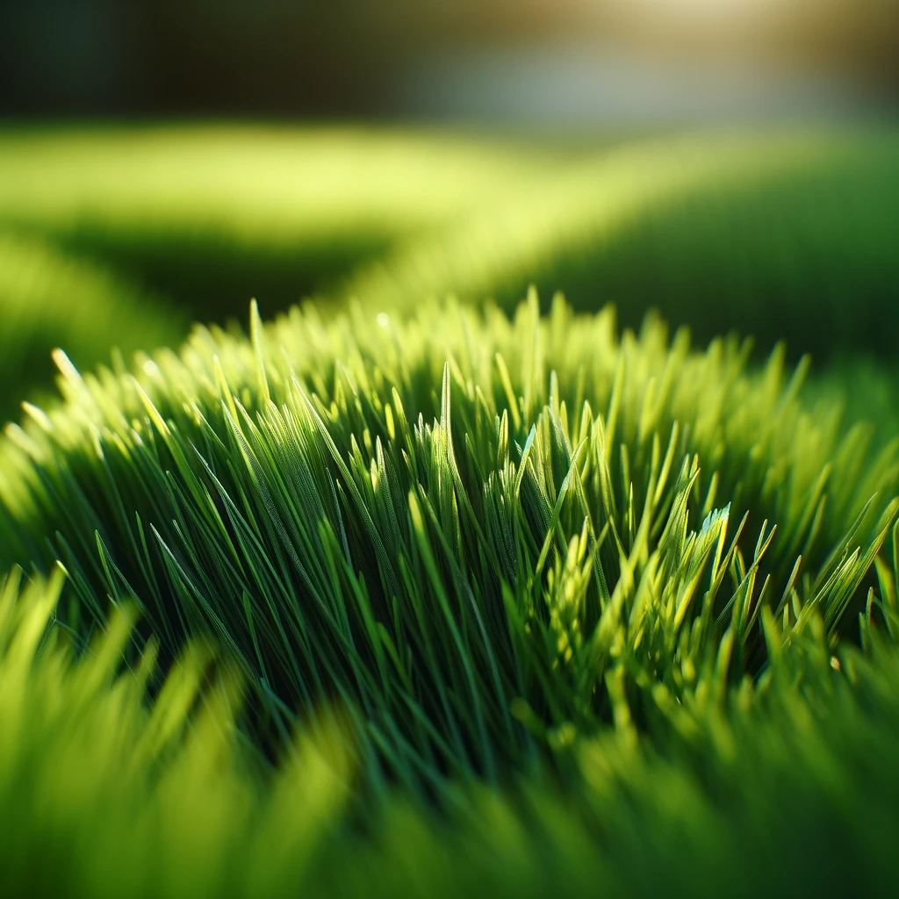
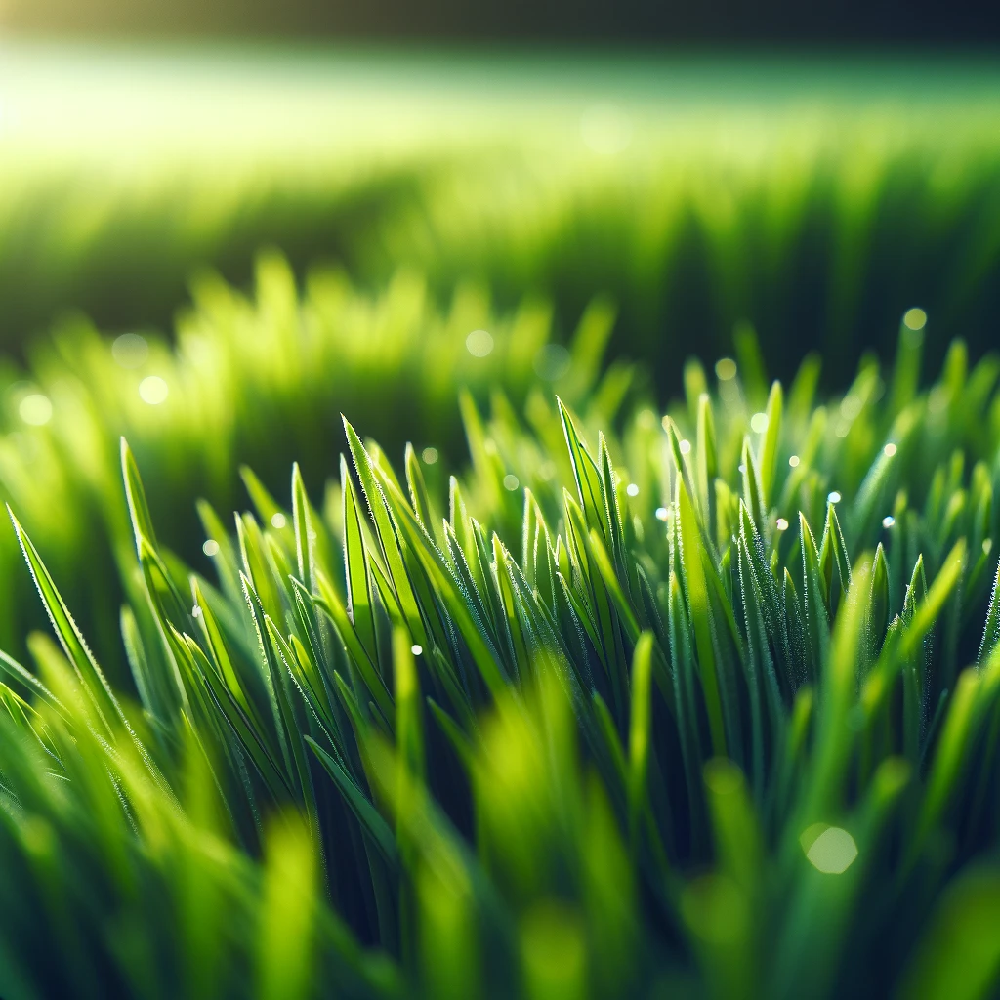
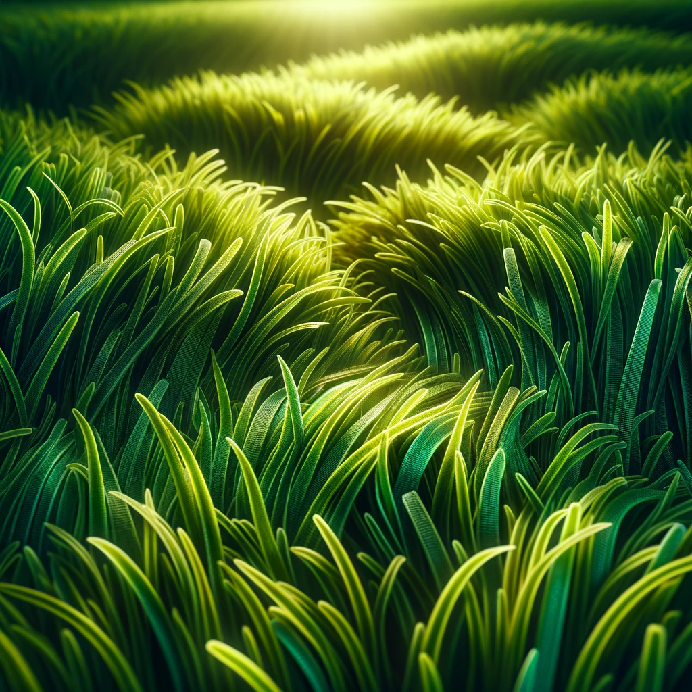
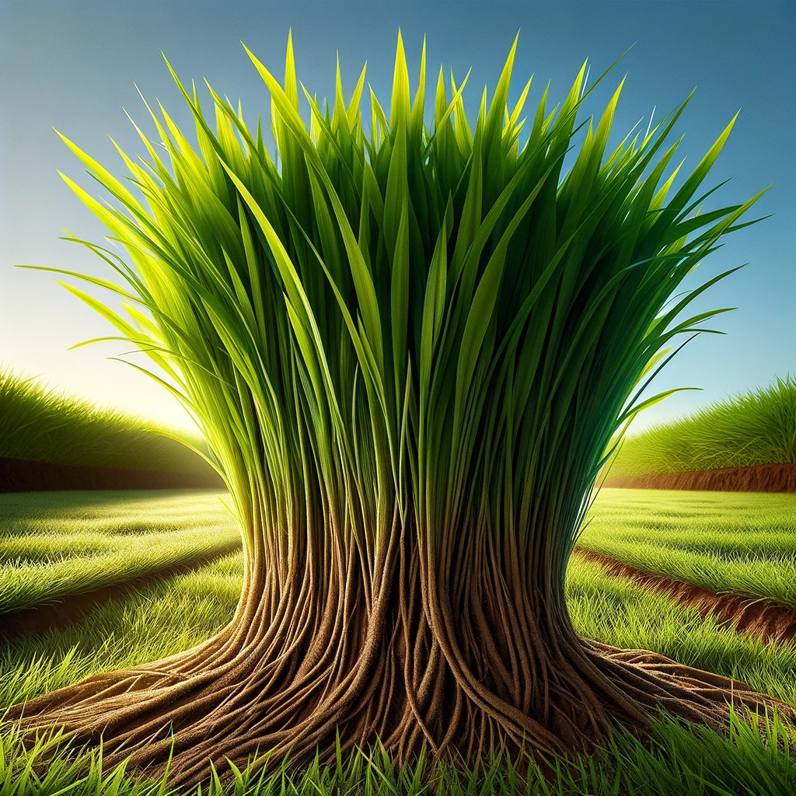
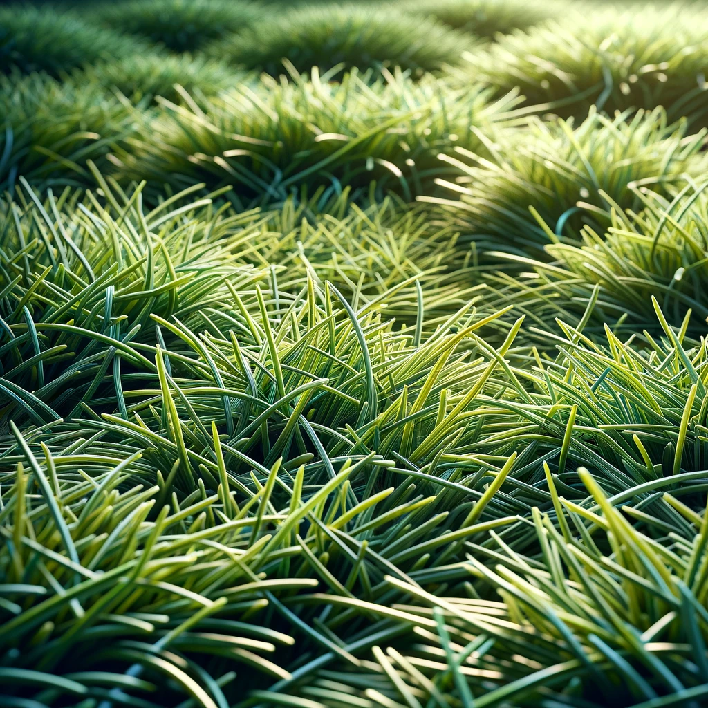

link to the query

QUESTION
**What are the  best grass to grow commercially in Jamaica?**

ANSWER

Growing grass commercially in Jamaica involves considering the climate, soil types, and intended use of the grass. Here are five types of grass that are generally well-suited for commercial growth in Jamaica:

1. **Zoysia Grass** - It's drought-tolerant and can withstand heavy foot traffic, making it ideal for golf courses, lawns, and public parks. Its ability to thrive in various soil types and its resistance to pests also contribute to its popularity in Jamaica.

2. **Bermuda Grass** - Known for its fine texture and high drought resistance, Bermuda grass is commonly used in sports fields, golf courses, and high-quality lawns. It grows quickly in the full sun and handles wear and tear very well.

3. **St. Augustine Grass** - This grass type is particularly suited for the coastal and tropical regions of Jamaica due to its salt tolerance. It's great for lawns that receive a mix of sun and shade, offering a dense cover that helps crowd out weeds.

4. **Bahia Grass** - Ideal for erosion control and as a forage grass due to its extensive root system. Bahia grass is low-maintenance, drought-tolerant, and suitable for less fertile, sandy soils, common in some parts of Jamaica.

5. **Centipede Grass** - Requires minimal care and is known for its ability to grow in acidic and sandy soils, which are prevalent in various regions of Jamaica. It's a slow-growing grass that provides a medium to coarse texture, making it suitable for lawns with lower maintenance needs.

These grass types are selected based on their adaptability to the climate, soil conditions, and the commercial needs of Jamaica, such as tourism (golf courses, resorts), agriculture (pastures for grazing), and urban planning (parks, lawns).

The images showcase the distinct characteristics of each grass type, highlighting their textures, colors, and how they might look in a well-maintained state.
